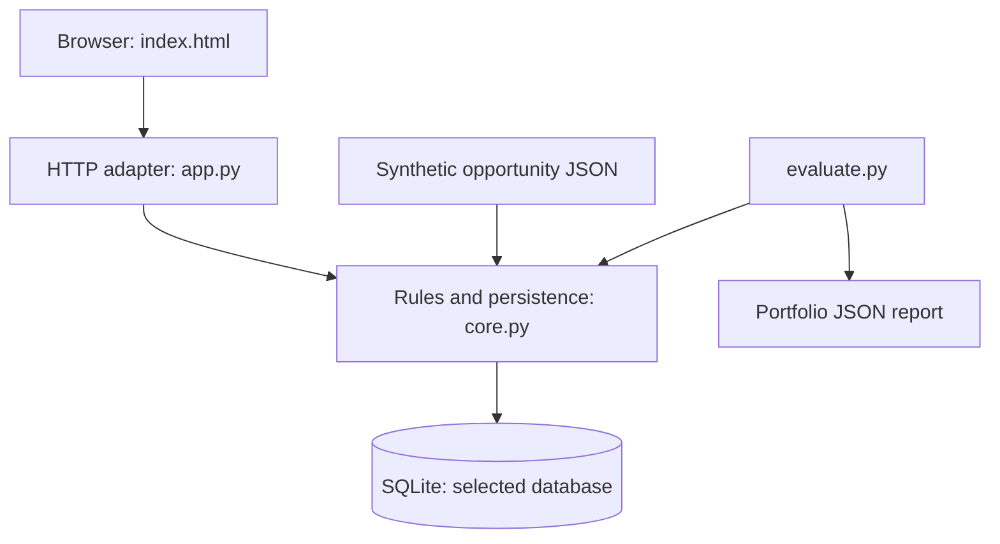

# Architecture

[Documentation index](README.md)

## Components and boundaries

The application separates a browser interface, HTTP adapter, business rules and SQLite persistence. It is a synchronous local application, not a distributed service.

`app.py` binds an `HTTPServer` to localhost. The handler opens a SQLite connection per API request and closes it afterward. `core.py` supplies scoring, financial calculations, pilot acceptance and stage transitions. `index.html` makes same-origin JSON requests and renders scenario cards, a portfolio table, pilot form and event list.

## Startup and request flow

Startup creates the database tables, validates source opportunities and inserts missing IDs in Discovery. `INSERT OR IGNORE` makes repeated startup idempotent: it does not overwrite existing payloads or stages. GET portfolio reads the stored payloads and calculates assessments dynamically. Recording a pilot replaces that opportunity's current aggregate result and inserts a historical event in the same transaction. Stage decisions update the stage and record a corresponding event together.

The standalone evaluator reads source JSON and calls `assess` directly. It neither seeds nor reads `local.db`; consequently its report may differ from a long-lived app database after fixture edits.

## Repository layout

| Path | Responsibility |
|---|---|
| `app.py` | CLI, localhost server and HTTP routes |
| `core.py` | Rules, validation, SQLite schema and mutations |
| `index.html` | Interface, input forms and API requests |
| `data/opportunities.json` | Six synthetic proposals used for initial seeding |
| `evaluate.py` | Reproducible assessment report generator |
| `tests/test_core.py` | Rule, financial-model and persistence tests |
| `tests/test_http.py` | Real HTTP workflow and error tests |
| `reports/` | Checked-in evaluation and baseline validation evidence |
| `docs/` | Technical and analyst documentation |
| `.github/workflows/checks.yml` | Test/evaluation workflow and JSON artifact upload |

## Operational constraints

`HTTPServer` handles requests sequentially. There is no login, background worker, API versioning, database migration framework or external connector. The schema is created with `CREATE TABLE IF NOT EXISTS`; an incompatible future schema change needs an explicit migration or a new demonstration database.

The app inserts audit events but does not cryptographically protect them or prevent outside edits. Pilot evidence can be recorded in any stage. Replacing metrics after approval does not recalculate or remove the Approved stage; evidence freshness and approval invalidation are required enterprise extensions.

Read [Data dictionary](data-dictionary.md), [API reference](api-reference.md) and [Decision model](decision-model.md) for exact contracts.
