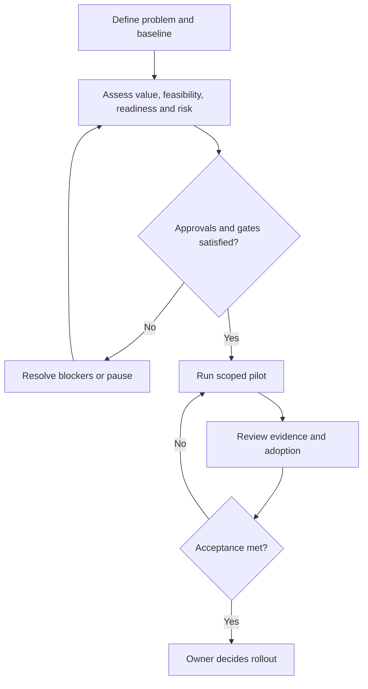

# Discovery, process and business case

## Current process (fictional)

Supervisor receives proposal → analyst requests missing details → IT checks data access → engineering assesses feasibility → sponsor decides whether to fund a pilot. Without shared criteria, promising proposals and risky proposals can look similarly attractive.

## Proposed process

## Scoring assumptions

Score = 20 × (0.35 × value + 0.25 × feasibility + 0.20 × readiness + 0.20 × (6 − risk)). Scores are 1–5; higher risk is worse. These weights are analyst assumptions and require sponsor agreement. Pilot gates independently require data and sponsor approval, risk below 4 and readiness at least 3.

## Document assistant business case

Assumed 40 users × 8 lookups/week × 5 minutes released × 48 weeks × 60% adoption = 768 hours/year. At an assumed CAD 35/hour this is CAD 26,880 gross annual capacity value. Deduct CAD 4,800 operating cost: CAD 22,080 annual net capacity value. Deduct CAD 12,000 implementation cost for CAD 10,080 first-year net value. Simple steady-state payback: 12,000 ÷ 22,080 × 12 = 6.5 months.

At 30% adoption the annual net value is CAD 8,640; at 85% it is CAD 33,280. Scenario rates are assumptions, not confidence intervals. The model does not include tax, inflation, discount rate, ramp-up, overtime effects or benefit overlap. Do not add opportunity benefits without checking double counting.

## Recommendation

Trial the document assistant against improved folder search, with both using the same approved documents. Defer autonomous robot adjustment: inadequate readiness, high risk and absent approvals. Assess whether supplier routing can be solved with rules before choosing AI. Financial upside alone is insufficient to justify AI.

## Measurement design

Record paired lookup tasks per participant and shift, source correctness and completion time. Counterbalance manual-search and assistant order. Report medians and failure rates as well as averages; inspect shift and tenure cohorts without identifying employees. Translate observed task improvement into a revised benefit model only after volumes and actual redeployment are validated.
